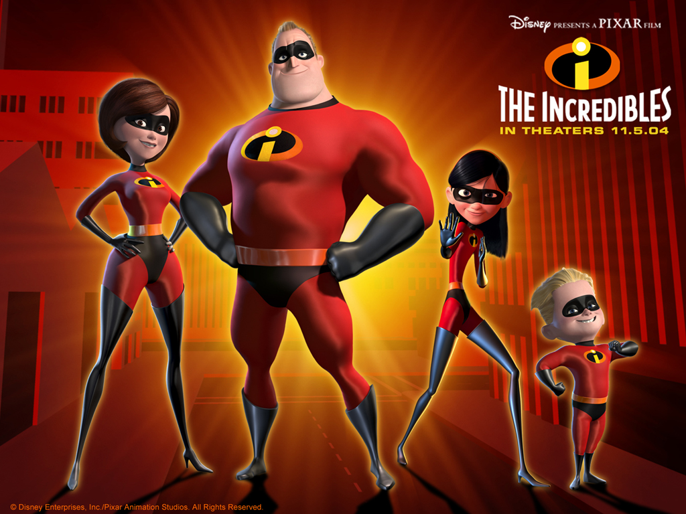
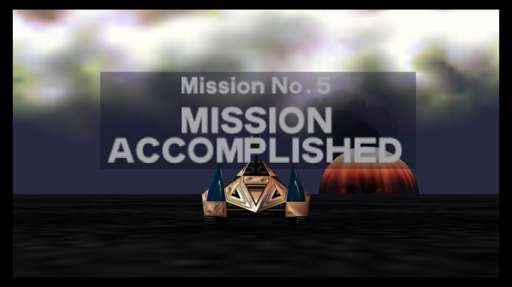

# Thank you Fastly! #

Sorry we got you in trouble!

# Thank you ModCloth! #

You folks are heroes!

# Resources #

- **DocHub**: <http://dochub.io> - Fast and easy search of the HTML, CSS, and
  JavaScript reference material.

- **Mozilla Developer Network**: <http://developer.mozilla.com> - Extensive
  documentation on all things web. With a comprehensive HTML5 section.

- **CSS Zen Garden**: <http://csszengarden.com> - A demonstration of the awesome
  power of CSS.

- **HTML5 Demos**: <http://html5demos.com> - Examples of cool tings you can do
  using HTML5.

- **OMG HTML**:
  <http://speakerdeck.com/u/nuclearsandwich/p/ryan-sandor-richards-omg-html> -
  Ryan's talk from this morning on HTML.

- **CSS WOW**:
  <http://speakerdeck.com/u/nuclearsandwich/p/ryan-sandor-richards-css-wow> -
  Ryan's talk from this morning on CSS.

# So #

# Who Made a New Friend? #

# Who Learnt Something New About HTML and CSS? #

# Who Had So Much Fun That They'll Come Back? #

